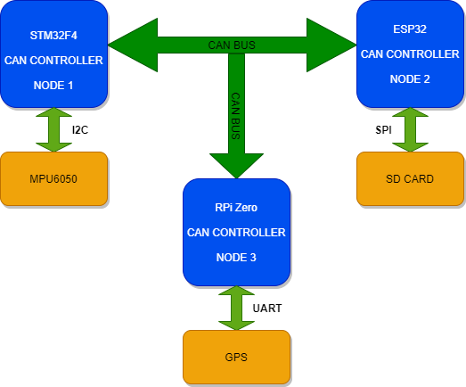
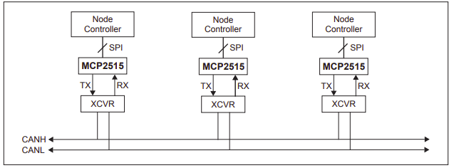

# Data Acquisition Using CAN bus
**Author:** MrMarshy

**Category:** Embedded Systems - CAN Bus

**Date:** 24th June 2021

----------------------------------------------------------------------

### Project Description

Implement a high speed data acquisition system using CAN bus and perform tasks according to the data received.
The system will collect data from sensors over multiple nodes and transmit the data over the CAN bus. 
The CAN packets are received by a single node which will do the required functionality as desired by the application.
The LEDs at the receiver node simulate the functions which can be done using the data acquired over the CAN bus.
Perform hardware filtering to manage the data packets on the CAN bus.

----------------------------------------------------------------------

### Aim of the Project
The aim of the project is to primarily investigate how the CAN Bus works. 

----------------------------------------------------------------------

### Project Diagrams

#### Project Block Diagram(s)

#### Project UML Diagrams

#### Project Circuit Diagram (Optional)

----------------------------------------------------------------------

### Project Construction (Optional)

----------------------------------------------------------------------

### Suggestions for Additional Work

----------------------------------------------------------------------
### Installation/Tutorials

----------------------------------------------------------------------
### References

1. [CAN Communication Part III | Communication E01 | Learn with George](https://www.youtube.com/watch?v=opxT3zUR-2Q)
2. [Adding CAN to the Raspberry Pi](https://www.beyondlogic.org/adding-can-controller-area-network-to-the-raspberry-pi/)
3. [CAN Bit Time Calculation](http://www.bittiming.can-wiki.info/)
4. [Social Edge](http://socialledge.com/sjsu/index.php/S14:_Data_Acquisition_using_CAN_bus)
5. [Wiki SocketCAN](https://en.wikipedia.org/wiki/SocketCAN)
6. [Linux Kernel Documentation CAN](https://www.kernel.org/doc/Documentation/networking/can.txt)
7. [quick-guide - CAN bus on raspberry pi with MCP2515](https://www.raspberrypi.org/forums/viewtopic.php?t=141052)

